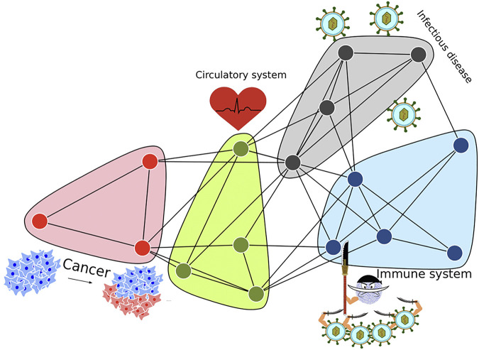
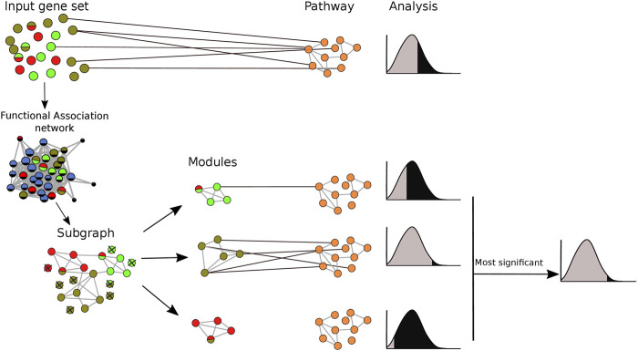

# Clustered Pathway Enrichment Analysis

This repository contains benchmark code and supporting assets for testing whether network-based pre-clustering improves pathway enrichment analysis on heterogeneous gene sets.

The benchmark projects query gene sets onto a functional association network, clusters them with MGclus, MCL, or Infomap, and compares downstream pathway recovery against non-clustered enrichment workflows.

<p align="center">
  
</p>

<p align="center">
  
</p>

## Background

Gene sets from experiments can mix multiple pathways. Splitting a projected network into more homogeneous modules can make enrichment calls easier to interpret and, in some settings, improve pathway recovery.

Related resources:

- Paper: [Clustered pathway enrichment analysis](https://www.frontiersin.org/journals/genetics/articles/10.3389/fgene.2022.855766/full)
- R package implementation: [ANUBIX](https://github.com/MiguelCastresana/anubix)
- Web implementation: [PathBIX](https://pathbix.sbc.su.se/)

## Repository Layout

```text
.
├── src/                 # Benchmark and plotting scripts
├── input/               # Committed benchmark inputs used by the scripts
├── results/             # Committed benchmark result tables
├── cluster_algorithms/  # Bundled MGclus/MCL assets used by the original benchmark
├── docs/                # Workflow and data notes
├── tools/               # Lightweight project checks
└── README.md
```

## Methods

The benchmark compares:

- MGclus: shared-neighbor clustering.
- MCL: Markov clustering.
- Infomap: information-theoretic community detection.
- No clustering: the original query gene set is passed directly to enrichment.

The clustered and non-clustered gene sets are evaluated with Gene Enrichment Analysis, BinoX, NEAT, and ANUBIX.

## Inputs

The committed `input/` directory contains benchmark gene sets and pathway-overlap resources. A functional association network is also required for new runs. For example, FunCoup human networks can be downloaded from the [FunCoup downloads page](https://funcoup.org/downloads/).

See [docs/data.md](docs/data.md) for more detail.

## Run A Quick Check

From the repository root:

```bash
Rscript tools/check-project.R
```

This parses the R scripts and checks that the expected benchmark folders are present. It does not rerun the full benchmark.

## Main Scripts

| Script | Purpose |
| --- | --- |
| `src/bisected_path_Creation.R` | Creates pathway splits for ground-truth pathway recovery tests. |
| `src/set_creation.R` | Creates true-positive and false-positive gene sets. |
| `src/clustering_genesets.R` | Runs MGclus, MCL, and Infomap on projected gene sets. |
| `src/cluster_jaccard_comparison.R` | Compares predicted modules to known pathways with Jaccard similarity. |
| `src/Cluster_Degree_Analysis.R` | Compares network-degree distributions of real and random gene sets. |
| `src/merge_FP_analysis.R` | Merges false-positive benchmark outputs. |
| `src/merge_TP_analysis.R` | Merges true-positive benchmark outputs. |
| `src/roc_curves.R` | Builds ROC curves for clustered and non-clustered outputs. |

See [docs/workflow.md](docs/workflow.md) for the recommended execution order.

## Contact

Miguel Castresana Aguirre  
[miguel.castresana.aguirre@ki.se](mailto:miguel.castresana.aguirre@ki.se)
